# Benchmarks

Criterion benchmarks comparing generic `Multivector` operations vs specialized 2D/3D types.

## Performance Summary

The specialized types provide significant speedups over the generic implementation:

| Operation | Generic | Specialized 3D | Specialized 2D | Speedup |
|-----------|---------|----------------|----------------|---------|
| Vector dot | ~60 ns | ~1.3 ns | ~0.8 ns | **46-75x** |
| Vector wedge | ~61 ns | ~1.5 ns | ~0.9 ns | **41-68x** |
| Vector add | ~1.6 ns | ~1.3 ns | ~0.8 ns | ~1.2-2x |
| Rotor rotation | ~51 ns | ~5.5 ns | ~1.5 ns | **9-34x** |
| Rotor compose | - | ~10.7 ns | ~1.0 ns | - |

## Generic Multivector Benchmarks

Operations on the sparse `Multivector<T, S>` type.

### Vector Addition (~1.6 ns)
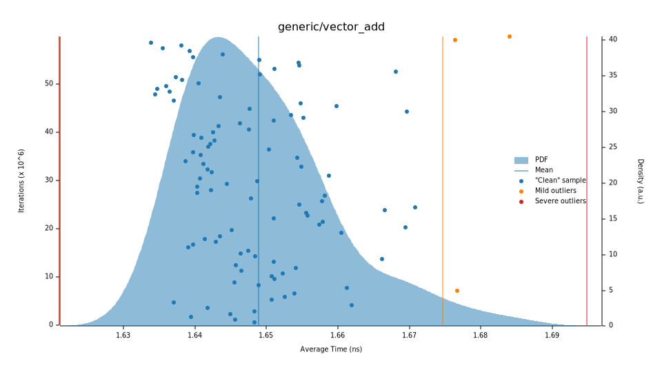

### Vector Dot Product (~60 ns)
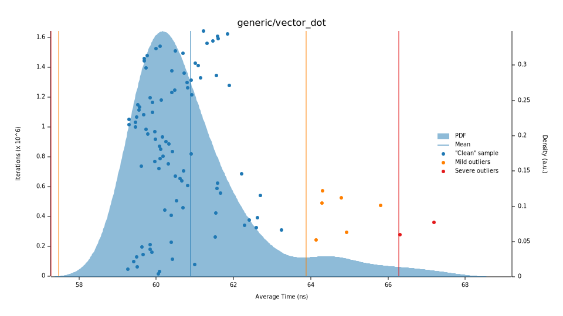

### Vector Wedge Product (~61 ns)
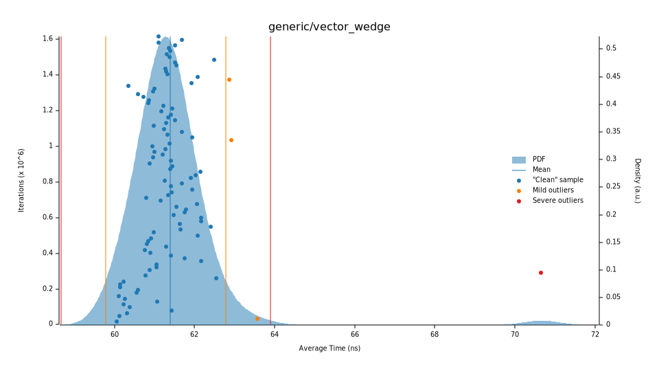

### Geometric Product (~41 ns)
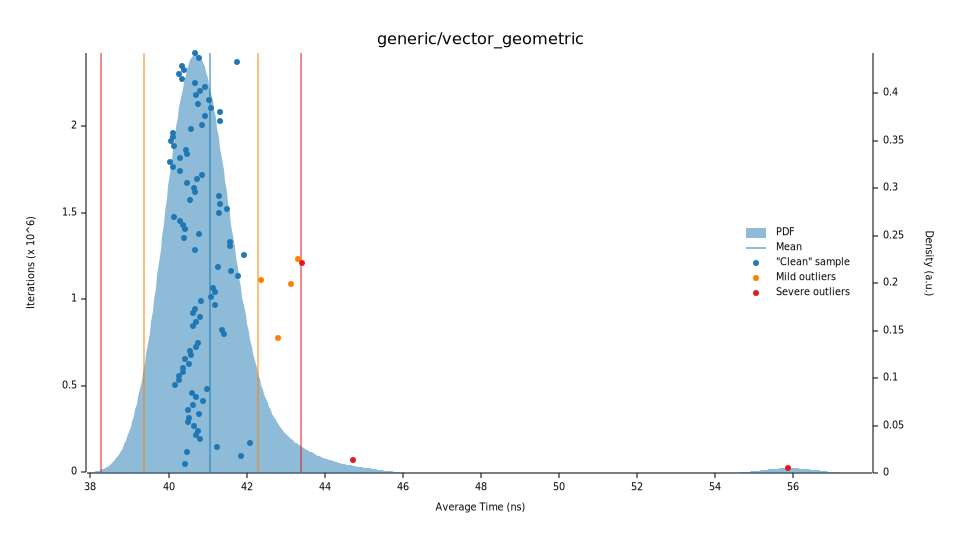

### Rotor Sandwich (~51 ns)
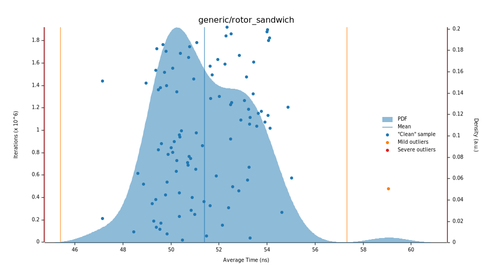

### Full Multivector Geometric (~280 ns)
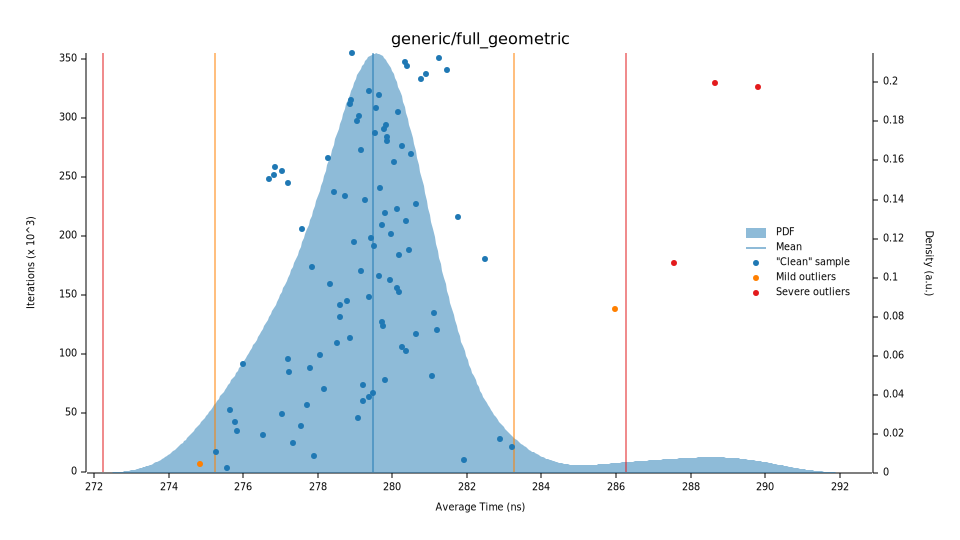

## Specialized 2D Benchmarks

Operations on fixed-size `Vec2`, `Rotor2` types.

### Vector Dot (~0.8 ns)


### Vector Wedge (~0.9 ns)


### Vector Add (~0.8 ns)
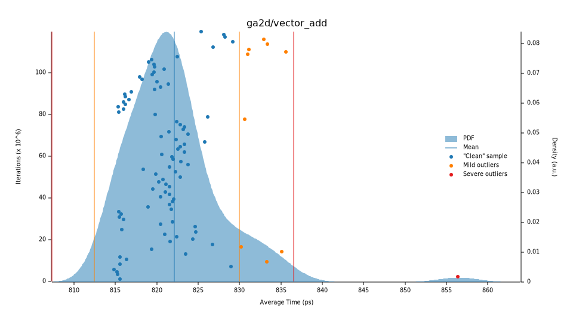

### Rotor Rotate (~1.5 ns)


### Rotor Compose (~1.0 ns)


### Rotor Slerp (~34 ns)


## Specialized 3D Benchmarks

Operations on fixed-size `Vec3`, `Bivec3`, `Rotor3` types.

### Vector Dot (~1.3 ns)
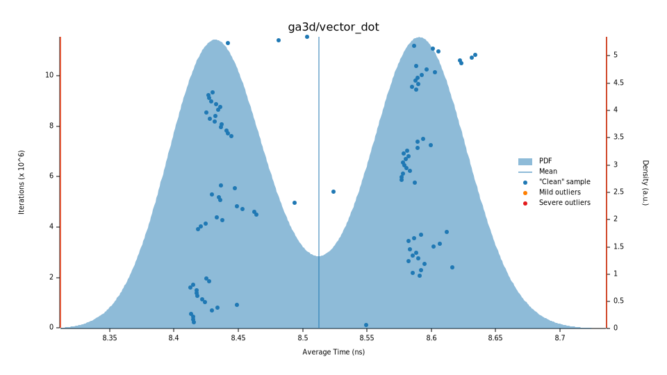

### Vector Wedge (~1.5 ns)


### Vector Cross (~1.5 ns)
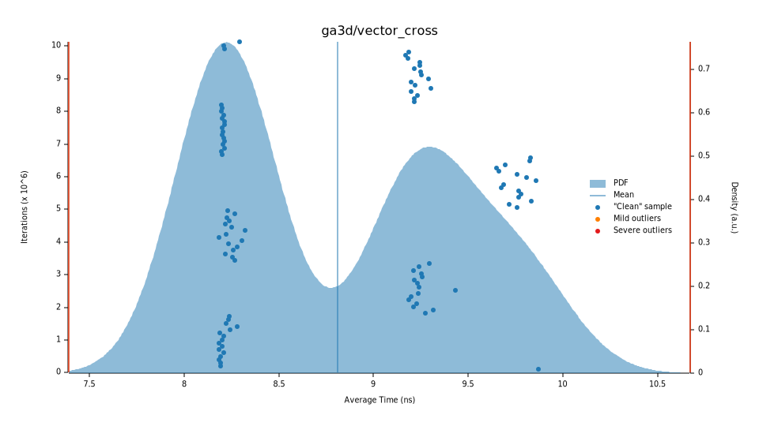

### Vector Add (~1.3 ns)


### Rotor Rotate (~5.5 ns)
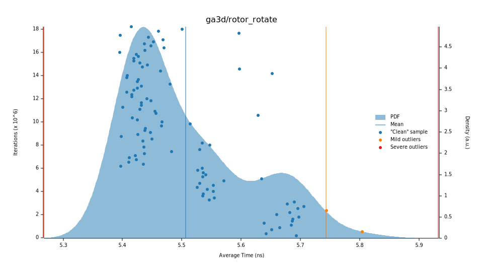

### Rotor Compose (~10.7 ns)
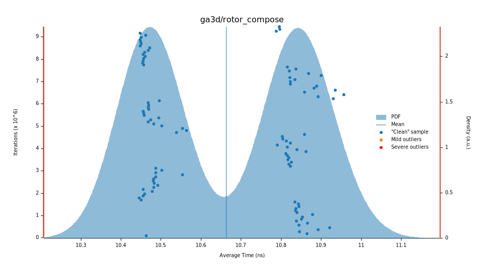

### Rotor Slerp (~35 ns)
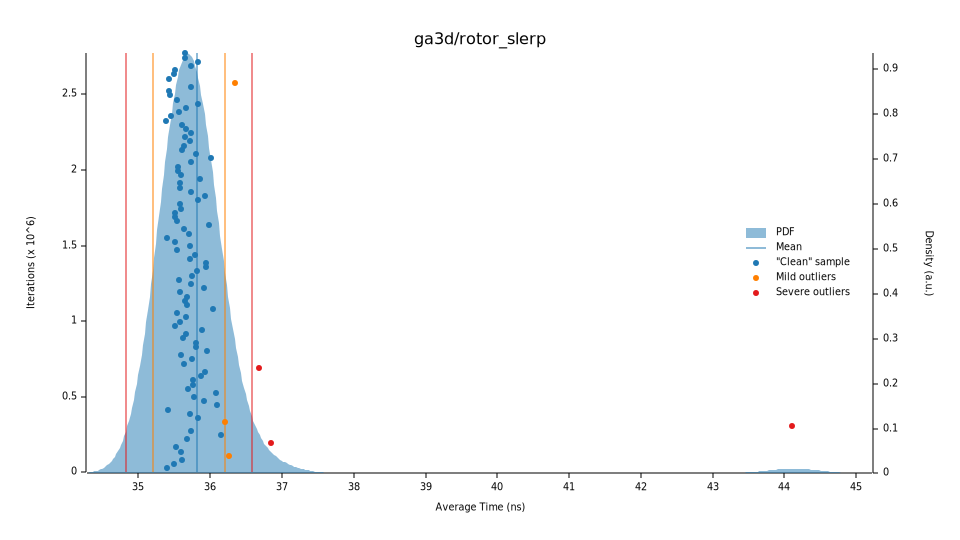

### Rotor from Vectors (~23 ns)
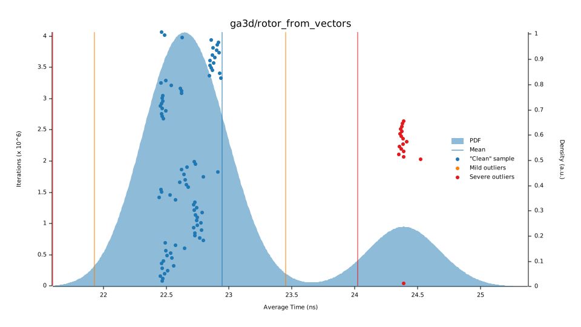

## Running Benchmarks

```bash
# Run all benchmarks
cargo bench

# Run only generic benchmarks
cargo bench --bench generic

# Run only specialized benchmarks
cargo bench --bench specialized

# Run specific benchmark by name
cargo bench -- "rotor"
```

After running, detailed HTML reports are generated at `target/criterion/report/index.html`.

## Regenerating Report Images

To update the SVG plots in this directory after running benchmarks:

```bash
# Copy all benchmark SVGs
for svg in target/criterion/*/report/pdf.svg; do
  bench=$(basename $(dirname $(dirname "$svg")))
  cp "$svg" "benches/reports/${bench}_pdf.svg"
done
```

## Adding New Benchmarks

1. Add benchmark function to appropriate file (`generic.rs` or `specialized.rs`):

```rust
fn bench_new_operation(c: &mut Criterion) {
    let a = Vec3::new(1.0, 2.0, 3.0);

    c.bench_function("ga3d/new_operation", |bencher| {
        bencher.iter(|| black_box(a).some_operation())
    });
}
```

2. Add the function to `criterion_group!` at the bottom of the file.

3. Run benchmarks: `cargo bench`

4. Copy the new SVG and update this README.
