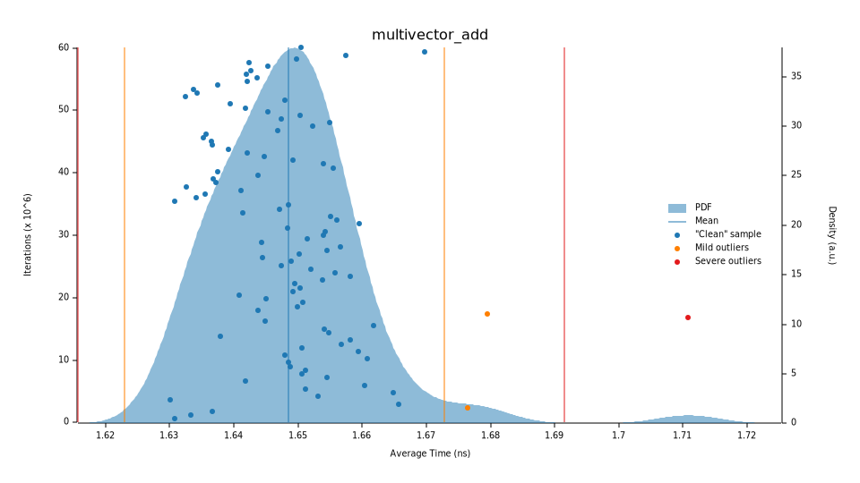
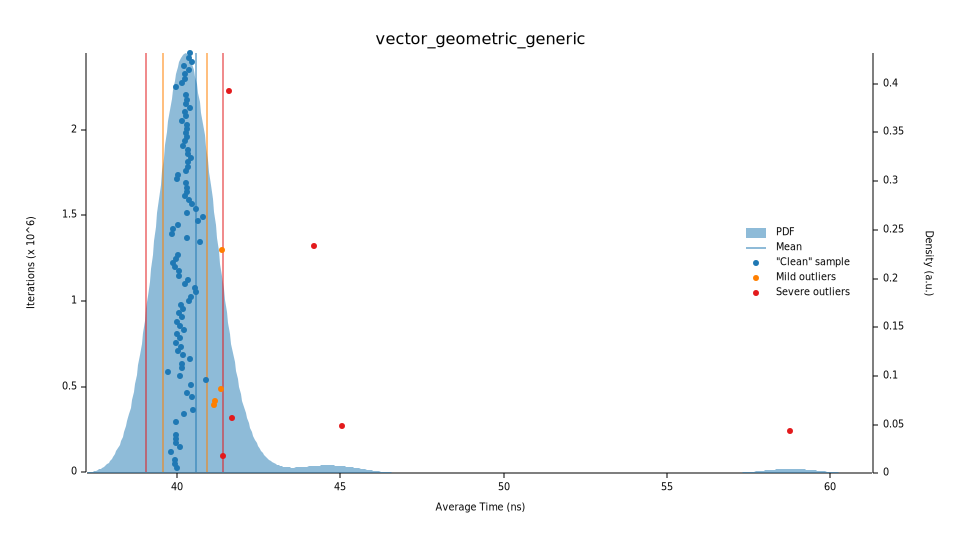
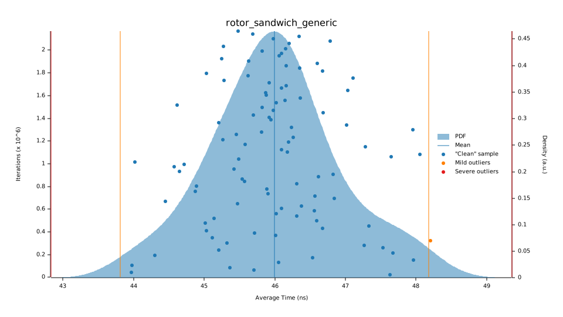
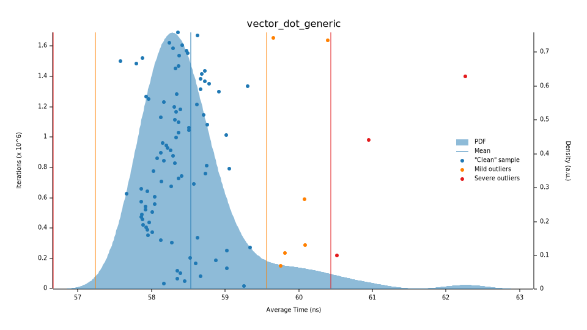
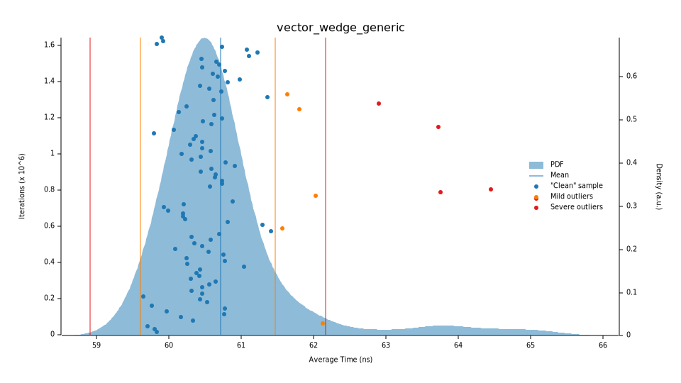
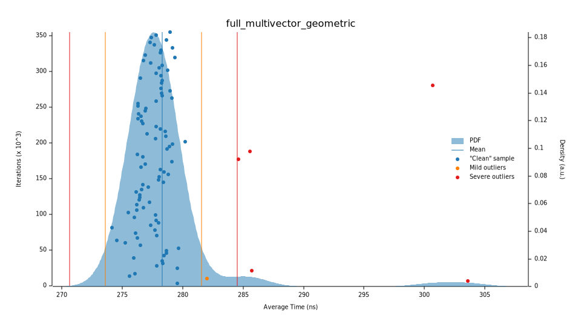

# Benchmarks

Criterion benchmarks for Clifford's `Multivector` operations on `Euclidean3` (3D space).

## Results Summary

| Benchmark | Time | Description |
|-----------|------|-------------|
| `multivector_add` | ~1.6 ns | Addition of two 3D multivectors |
| `vector_geometric_generic` | ~40 ns | Geometric product of two 3D vectors |
| `rotor_sandwich_generic` | ~46 ns | Rotor rotation via sandwich product |
| `vector_dot_generic` | ~58 ns | Inner product of two 3D vectors |
| `vector_wedge_generic` | ~61 ns | Outer (wedge) product of two 3D vectors |
| `full_multivector_geometric` | ~278 ns | Geometric product with all 8 components |

## Timing Distributions

### Multivector Addition (~1.6 ns)


### Geometric Product - Vectors (~40 ns)


### Rotor Sandwich Product (~46 ns)


### Inner Product (~58 ns)


### Outer/Wedge Product (~61 ns)


### Full Multivector Geometric Product (~278 ns)


## Running Benchmarks

```bash
cargo bench
```

After running, detailed HTML reports are generated at `target/criterion/report/index.html`.

## Regenerating Report Images

To update the SVG plots in this directory after running benchmarks:

```bash
for bench in vector_dot_generic vector_wedge_generic vector_geometric_generic \
             rotor_sandwich_generic multivector_add full_multivector_geometric; do
  cp "target/criterion/$bench/report/pdf.svg" "benches/reports/${bench}_pdf.svg"
done
```

## Adding New Benchmarks

When adding new operations, add benchmarks to `multivector.rs`:

```rust
fn bench_new_operation(c: &mut Criterion) {
    let a: Multivector<f64, Euclidean3> = Multivector::vector(&[1.0, 2.0, 3.0]);

    c.bench_function("new_operation", |bencher| {
        bencher.iter(|| black_box(&a).some_operation())
    });
}
```

Add the function to `criterion_group!` at the bottom of the file, run benchmarks, and copy the new SVG.
